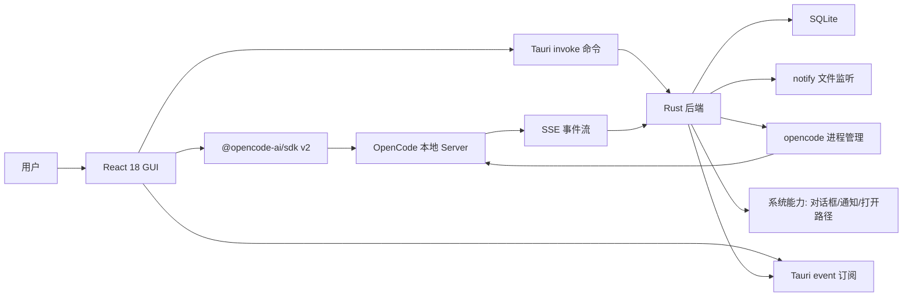
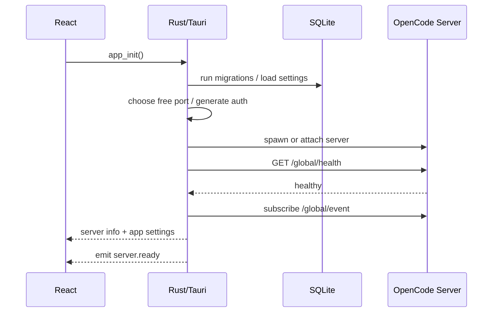

# OpenCode 新 GUI 工具规划

## 1. 背景与目标

当前仓库历史上曾有旧 Solid 前端和 Electron 桌面壳。为了避免和旧实现互相牵制，新 GUI 独立建设为 `packages/gui`。

本计划目标是生成一套可长期维护、可打包为 Windows exe 的新 GUI 工具：

- 前端：React 18 + Vite + TypeScript。
- UI：shadcn/ui + Tailwind + lucide-react。
- 后端：Rust + tokio + serde + SQLite 持久化 + notify 文件监听。
- 桌面打包：建议使用 Tauri v2，Rust 作为桌面后端和本地协调层。
- OpenCode 核心能力：优先复用现有 opencode server/API/SDK，不重写会话、模型、权限、PTY 等核心逻辑。
- 产品体验：按照 Codex 工作台方向设计，突出线程、计划、执行记录、审批、diff review、终端和文件变更，而不是复刻现有 OpenCode GUI。

## 1.1 Codex 风格定位

这里的“按照 Codex 去做”指交互模型和信息架构借鉴 Codex 桌面工作台，而不是复制品牌或视觉资产。新 GUI 应让用户感觉它是一个围绕代码任务展开的 agent workspace：

- 线程优先：左侧是任务/会话线程，主区始终围绕当前线程展开。
- 计划可见：任务开始后有清晰 plan/checklist，能展示 pending、in progress、completed。
- 执行透明：命令、文件读取、文件编辑、测试、错误都进入 activity timeline。
- 审批明确：高风险操作、权限请求、外部命令、文件变更确认以独立审批面板呈现。
- Diff 一等公民：代码变更不是藏在消息里，而是有专门 review 面板、文件树和变更状态。
- 终端贴近上下文：终端输出和 agent 运行状态在同一个工作流里，不让用户在多个窗口间跳。
- 结果收束：每个线程结束时有简短摘要、修改文件、验证结果和后续建议。

产品上要避免做成普通聊天软件。它应该更像“带 GUI 的本地 Codex agent”：用户给任务，GUI 展示 agent 如何理解、计划、执行、改文件、跑验证，以及哪里需要用户批准。

最新定位补充：应用打开后不再强调 OpenCode 的配置面板或管理后台，而是直接进入一个 Codex 桌面工作台。用户看到的是项目、线程、执行流、审批和输入区；OpenCode server、session API、SSE、permission API 都作为底层能力被工作台调用和编排。

## 2. 当前源码观察

| 模块 | 现状 | 对新 GUI 的影响 |
| --- | --- | --- |
| 旧 Solid 前端 | Solid + Vite 前端，依赖 `@opencode-ai/sdk`、`@opencode-ai/ui` | 已移除，不再作为复用来源 |
| 旧 Electron 桌面壳 | package 脚本为 Electron，包含主进程、preload、renderer、electron-builder 配置 | 已移除，不再作为复用来源 |
| `packages/opencode` | opencode 核心、server、HTTP API、SSE、PTY WebSocket、TUI | 新 GUI 应通过 HTTP/SSE/WebSocket 调用它，而不是复制业务逻辑 |
| `packages/sdk/js` | 由 OpenAPI 生成的 JS SDK，包含 v2 client | React 前端可直接复用 SDK，减少接口手写成本 |

已确认的关键能力：

- 健康检查：`/global/health`。
- 全局事件流：`/global/event`，SSE，含 heartbeat。
- 实例事件流：`/event`，SSE。
- 会话 API：`/session/*` 与 v2 `/api/session/*`。
- 权限 API：`/permission/*` 与 `/session/{sessionID}/permissions/*`。
- 文件 API：`/file`、`/file/content`、`/file/status`、`/find/file`、`/find/text`。
- PTY API：`/pty`、`/pty/{ptyID}/connect-token`、`/pty/{ptyID}/connect`。
- Provider/API 配置：`/provider`、`/config/providers`、`/global/config`。

## 3. 技术路线

### 3.1 推荐结论

新建 `packages/gui`，内部使用 Tauri v2 标准结构：

```text
packages/gui/
  package.json
  index.html
  vite.config.ts
  tsconfig.json
  tailwind.config.ts
  postcss.config.js
  components.json
  src/
    main.tsx
    app/
    components/
    components/ui/
    features/
    lib/
    styles/
  src-tauri/
    Cargo.toml
    tauri.conf.json
    build.rs
    migrations/
    src/
      main.rs
      state.rs
      error.rs
      commands/
      services/
      storage/
      watcher/
      opencode/
      events/
```

选择原因：

- Tauri 与 React/Vite/Rust 的组合天然适合打包 exe。
- Rust 后端可以直接负责进程管理、SQLite、文件监听、系统通知、路径选择、安全 token。
- 前端保持纯 React 应用，UI 可以完全按你的审美重做。
- 与旧桌面壳隔离，降低迁移风险。

### 3.2 前端技术栈

| 类别 | 选型 | 用途 |
| --- | --- | --- |
| 框架 | React 18 | 应用 UI |
| 构建 | Vite + TypeScript | 开发与生产构建 |
| UI | shadcn/ui + Tailwind | 通用控件、主题、布局 |
| 图标 | lucide-react | 工具按钮、状态、导航 |
| 数据请求 | `@tanstack/react-query` | server state、缓存、重试 |
| 路由 | `react-router-dom` | 工作区、会话、设置页面 |
| SDK | `@opencode-ai/sdk/v2/client` | 调用现有 OpenCode HTTP API |
| 虚拟列表 | `@tanstack/react-virtual` 或 `virtua` | 会话列表、消息时间线 |
| 编辑输入 | textarea 起步，后续可接 CodeMirror | prompt 输入、多行编辑 |
| 终端 | xterm.js | PTY WebSocket 交互 |
| Markdown/代码高亮 | marked + shiki | assistant 消息、代码块 |

### 3.3 Rust 技术栈

| 类别 | 选型 | 用途 |
| --- | --- | --- |
| 桌面壳 | Tauri v2 | 窗口、命令、打包、插件 |
| 异步运行时 | tokio | opencode 进程、HTTP/SSE、文件监听任务 |
| 序列化 | serde / serde_json | Tauri command DTO、配置、事件 |
| 本地数据库 | 首选 sqlx + SQLite | 异步查询、迁移、连接池 |
| 轻量备选 | rusqlite | 如果 sqlx 编译成本或迁移复杂度过高时替代 |
| 文件监听 | notify | 工作区文件变化、配置变化 |
| HTTP 客户端 | reqwest | 健康检查、SSE/API 桥接 |
| 日志 | tracing / tracing-subscriber | 本地诊断日志 |
| 错误 | thiserror / anyhow | 边界错误和内部错误 |

数据库建议首选 `sqlx`，因为它和 tokio、迁移、连接池更自然。`rusqlite` 可作为第二选择，适合只做少量同步读写的轻量版本。

## 4. 总体架构



核心原则：

- OpenCode 业务核心继续由现有 server 承担。
- Rust 后端不重写 AI 会话逻辑，只做本地应用协调层。
- React 前端通过 SDK 调用 OpenCode API，通过 Tauri commands 调用本地能力。
- 高频事件优先由 Rust 订阅 SSE 后合并、节流，再通过 Tauri event 推给 React，避免 WebView 里事件处理过载。

## 5. 模块设计

### 5.1 前端模块列表

| 模块 | 功能 |
| --- | --- |
| App Shell | 主窗口布局、侧边栏、标题栏、命令面板、主题 |
| Workspace | 工作区选择、最近项目、打开目录、工作区状态 |
| Thread List | Codex 风格任务线程列表、搜索、过滤、收藏、归档入口 |
| Thread Workspace | 当前线程的 plan、activity、messages、result summary |
| Chat Timeline | 消息时间线、流式更新、代码块、工具调用展示 |
| Composer | prompt 输入、附件、模型/agent/permission 选择、提交/中断 |
| Plan Panel | 展示 agent plan/checklist，支持状态更新和折叠 |
| Activity Timeline | 展示命令、文件读写、测试、错误、重试、审批记录 |
| Diff Review | git/file diff、apply patch 结果、文件变更查看 |
| File Explorer | 文件树、文件搜索、内容预览、打开外部编辑器 |
| Permission Center | 权限请求、问题请求、批准/拒绝、自动规则 |
| Terminal | PTY 列表、新建终端、WebSocket 连接、命令运行 |
| Provider Settings | provider 列表、认证、默认模型、API key 状态 |
| App Settings | 主题、字体、缩放、server、数据库、日志、更新 |

### 5.2 Rust 后端模块列表

| 模块 | 功能 |
| --- | --- |
| `commands` | Tauri command 入口，定义前后端契约 |
| `opencode/process` | 启动、停止、重启、健康检查 opencode server |
| `opencode/client` | Rust 侧 HTTP client，负责 health、SSE、必要桥接 |
| `events` | SSE 订阅、重连、heartbeat、事件合并、Tauri event emit |
| `activity` | 将 OpenCode 事件归一化为 Codex 风格 activity item |
| `plan` | 保存和广播线程计划状态、任务步骤和完成状态 |
| `storage` | SQLite 初始化、迁移、DAO、配置持久化 |
| `watcher` | notify 文件监听、去抖、目录白名单 |
| `native` | 打开文件、打开链接、目录选择、通知 |
| `security` | 本地随机密码/token、server 绑定 loopback、敏感信息不落盘 |
| `logging` | tracing 初始化、日志文件、前端错误上报 |

## 6. 关键业务流程

### 6.1 应用启动流程



启动策略：

- 默认绑定 `127.0.0.1` 随机端口。
- 每次启动生成随机 password/token，仅在内存中保存。
- 如果用户配置了外部 server，则先 health check，失败后提示切换本地 server。
- 打包版本通过 Tauri sidecar 或 bundled binary 启动 opencode。

### 6.2 打开工作区流程

1. React 调用 `pick_directory` 或选择最近项目。
2. Rust 校验路径、保存 recent workspace。
3. React 使用 SDK 设置 directory/workspace 参数并加载 project/session。
4. Rust 对该目录启动 notify watcher。
5. 文件变化事件进入前端，触发 file status 和 session context 局部刷新。

### 6.3 发送 Prompt 流程

1. Composer 收集文本、文件引用、图片附件、模型、权限策略。
2. React 通过 SDK 调用 `/session/{sessionID}/prompt_async` 或 v2 `/api/session/{sessionID}/prompt`。
3. Rust 侧 SSE listener 接收 `message.*`、`session.status`、`permission.*` 事件。
4. React Query 缓存和本地 reducer 合并事件，更新 timeline。
5. 用户可通过 `/session/{sessionID}/abort` 中断。

### 6.4 权限处理流程

1. 后端事件推送 permission/question request。
2. UI 在 Composer 上方或右侧 Permission Center 展示待处理项。
3. 用户批准、拒绝或选择一次性/本会话/全局规则。
4. React 调用 `/permission/{requestID}/reply` 或 session permission reply API。
5. 本地 DB 只存 GUI 偏好和用户选择的自动响应规则，不存敏感凭据。

## 7. 数据库规划

SQLite 只保存 GUI 自身状态和缓存索引，不作为 OpenCode 会话主存储。

### 7.1 表设计

#### `app_settings`

| 字段 | 类型 | 说明 |
| --- | --- | --- |
| `key` | TEXT PRIMARY KEY | 配置 key |
| `value_json` | TEXT NOT NULL | JSON 配置值 |
| `updated_at` | INTEGER NOT NULL | 更新时间 |

#### `workspaces`

| 字段 | 类型 | 说明 |
| --- | --- | --- |
| `id` | TEXT PRIMARY KEY | GUI 工作区 ID |
| `path` | TEXT NOT NULL UNIQUE | 本地路径 |
| `name` | TEXT | 展示名 |
| `icon` | TEXT | 图标或颜色 |
| `last_opened_at` | INTEGER NOT NULL | 最近打开时间 |
| `created_at` | INTEGER NOT NULL | 创建时间 |

#### `server_profiles`

| 字段 | 类型 | 说明 |
| --- | --- | --- |
| `id` | TEXT PRIMARY KEY | server 配置 ID |
| `kind` | TEXT NOT NULL | `local` 或 `remote` |
| `base_url` | TEXT | 远程 server 地址 |
| `username` | TEXT | 用户名，默认 opencode |
| `created_at` | INTEGER NOT NULL | 创建时间 |
| `updated_at` | INTEGER NOT NULL | 更新时间 |

#### `ui_sessions`

| 字段 | 类型 | 说明 |
| --- | --- | --- |
| `id` | TEXT PRIMARY KEY | GUI 记录 ID |
| `workspace_id` | TEXT NOT NULL | 关联工作区 |
| `opencode_session_id` | TEXT NOT NULL | OpenCode session ID |
| `pinned` | INTEGER NOT NULL DEFAULT 0 | 是否置顶 |
| `last_seen_at` | INTEGER | 最后阅读时间 |
| `created_at` | INTEGER NOT NULL | 创建时间 |

#### `thread_runs`

| 字段 | 类型 | 说明 |
| --- | --- | --- |
| `id` | TEXT PRIMARY KEY | GUI thread/run ID |
| `workspace_id` | TEXT NOT NULL | 关联工作区 |
| `opencode_session_id` | TEXT | 关联 OpenCode session ID |
| `title` | TEXT | 线程标题 |
| `status` | TEXT NOT NULL | `idle`、`running`、`waiting`、`failed`、`completed` |
| `plan_json` | TEXT | Codex 风格 plan/checklist |
| `summary_json` | TEXT | 完成摘要、验证结果、风险 |
| `created_at` | INTEGER NOT NULL | 创建时间 |
| `updated_at` | INTEGER NOT NULL | 更新时间 |

#### `thread_activity`

| 字段 | 类型 | 说明 |
| --- | --- | --- |
| `id` | TEXT PRIMARY KEY | activity ID |
| `thread_id` | TEXT NOT NULL | 关联 thread |
| `kind` | TEXT NOT NULL | `command`、`file_read`、`file_edit`、`approval` 等 |
| `status` | TEXT NOT NULL | `pending`、`running`、`success`、`failed`、`cancelled` |
| `title` | TEXT NOT NULL | 展示标题 |
| `payload_json` | TEXT | 命令、文件、耗时、摘要等扩展信息 |
| `created_at` | INTEGER NOT NULL | 创建时间 |

#### `event_offsets`

| 字段 | 类型 | 说明 |
| --- | --- | --- |
| `scope` | TEXT PRIMARY KEY | `global` 或 workspace/session |
| `last_event_id` | TEXT | 最近处理事件 ID |
| `updated_at` | INTEGER NOT NULL | 更新时间 |

### 7.2 迁移策略

- `src-tauri/migrations` 保存 SQL 迁移。
- 每次启动执行迁移。
- 迁移失败时进入只读恢复模式，UI 提供导出日志和重建缓存按钮。
- 不把 API key、server password、OAuth token 明文写入 GUI DB。

## 8. 前后端契约

### 8.1 Tauri Commands

| 命令 | 入参 | 返回 | 说明 |
| --- | --- | --- | --- |
| `app_init` | 无 | `AppInitResult` | 初始化数据库、server、设置 |
| `server_start` | `ServerStartInput` | `ServerInfo` | 启动本地 opencode server |
| `server_stop` | 无 | `()` | 停止本地 server |
| `server_status` | 无 | `ServerStatus` | 返回健康状态 |
| `workspace_pick` | `PickOptions` | `Option<String>` | 打开目录选择器 |
| `workspace_open` | `WorkspaceOpenInput` | `WorkspaceInfo` | 记录并打开工作区 |
| `settings_get` | `key` | `serde_json::Value` | 获取 GUI 设置 |
| `settings_set` | `key/value` | `()` | 保存 GUI 设置 |
| `open_path` | `path/app` | `()` | 用系统或指定编辑器打开路径 |
| `open_url` | `url` | `()` | 打开外部链接 |
| `notify` | `title/body` | `()` | 系统通知 |
| `watch_start` | `path` | `WatcherId` | 开始文件监听 |
| `watch_stop` | `WatcherId` | `()` | 停止文件监听 |

### 8.2 Tauri Events

| 事件 | 载荷 | 用途 |
| --- | --- | --- |
| `server.ready` | `ServerInfo` | server 可用 |
| `server.health` | `ServerStatus` | 健康变化 |
| `opencode.event` | `OpenCodeEventEnvelope` | SSE 事件转发 |
| `thread.activity` | `ActivityItem` | Codex 风格执行记录 |
| `thread.plan` | `PlanState` | 当前线程计划状态 |
| `thread.result` | `ThreadResult` | 完成摘要和验证结果 |
| `watcher.changed` | `FileChangeBatch` | 文件变化 |
| `app.notification-clicked` | `NotificationPayload` | 通知点击 |
| `app.log` | `LogEntry` | 前端调试面板 |

## 9. UI 设计方向

定位是开发工具，不做营销式首页。应用第一屏就是可用工作台。

推荐布局：

- 左侧窄导航：工作区、线程、文件、终端、设置。
- 左侧主栏：当前工作区的 thread/session 列表，可搜索、过滤、置顶。
- 中间主区：Codex 风格线程工作台，上方是任务摘要和运行状态，中间是 plan/activity/messages，下方是 composer。
- 右侧可折叠面板：上下文、diff、文件、权限、终端详情。
- 底部状态栏：server 状态、模型、分支、token/上下文指标、后台任务。

### 9.1 Codex 工作台布局

主区建议采用四层结构：

| 区域 | 内容 | 设计要求 |
| --- | --- | --- |
| Thread Header | 任务标题、工作区、分支、模型、运行状态、中断按钮 | 信息紧凑，状态醒目 |
| Plan Strip | 当前 plan/checklist，可折叠 | 让用户随时知道 agent 下一步在做什么 |
| Activity + Messages | 左侧或主流展示自然语言消息，工具调用以 activity item 呈现 | 命令、读文件、改文件、测试结果要有清楚状态 |
| Composer Dock | 输入框、附件、模式、权限策略、发送按钮 | 保持固定在底部，适合长任务持续交互 |

Activity item 类型建议：

| 类型 | 示例 | UI 表现 |
| --- | --- | --- |
| `thinking` | 分析需求、整理上下文 | 低对比文本，可折叠 |
| `plan_update` | 更新计划步骤状态 | checklist 行状态变化 |
| `command` | 运行 `cargo test`、`bun build` | 命令块 + 状态 + 耗时 |
| `file_read` | 读取源码、搜索引用 | 文件路径 + 摘要 |
| `file_edit` | 修改文件 | 文件路径 + diff 入口 |
| `approval` | 请求执行敏感命令或权限 | 独立高亮审批卡片 |
| `error` | 命令失败、server 断开 | 错误卡片 + 重试入口 |
| `result` | 完成摘要、验证结果 | 线程末尾收束卡片 |

### 9.2 Codex 化功能优先级

第一版就要有的 Codex 风格能力：

- 线程列表和线程详情，而不是单纯 session chat。
- plan/checklist 展示。
- activity timeline 展示命令、文件、测试、审批。
- diff review 右侧面板。
- 中断/继续/重试等运行控制。
- 完成摘要：改了什么、验证了什么、还有什么风险。

第二版再增强：

- inline code review comment。
- 多线程并行运行状态。
- activity 搜索和过滤。
- 任务模板和快捷命令。
- 自动生成 PR 描述或变更摘要。

shadcn/ui 使用建议：

- `Button` + lucide 图标用于工具动作。
- `Command` 用于全局命令面板和快速跳转。
- `ResizablePanel` 用于主布局宽度调整。
- `ScrollArea` 用于 thread list、activity timeline 和 message timeline。
- `Tabs` 用于右侧 context/diff/files/terminal。
- `Dialog` / `Sheet` 用于设置、provider 登录、确认操作。
- `Tooltip` 用于图标按钮。
- `DropdownMenu` 用于 session、模型、权限策略菜单。
- `Sonner` 用于 toast。

视觉原则：

- 保持密度、清晰层级和长时间使用的舒适度。
- 避免大面积装饰渐变、营销 hero、卡片套卡片。
- 信息优先：会话状态、变更文件、权限请求、正在运行任务必须醒目。
- 支持浅色/深色主题，优先保证深色模式代码阅读体验。

## 10. 打包与发布方案

### 10.1 开发脚本

建议 `packages/gui/package.json` 提供：

```json
{
  "scripts": {
    "dev": "vite",
    "tauri:dev": "tauri dev",
    "build": "vite build",
    "tauri:build": "tauri build",
    "typecheck": "tsc --noEmit",
    "lint": "eslint .",
    "test": "vitest"
  }
}
```

根目录可追加：

```json
{
  "scripts": {
    "dev:gui": "bun --cwd packages/gui tauri:dev",
    "build:gui": "bun --cwd packages/gui tauri:build"
  }
}
```

### 10.2 Windows exe

Tauri Windows 构建输出：

- 开发预览：`target/release/opencode-gui.exe`。
- 安装包：MSI 或 NSIS，优先 NSIS，方便安装目录选择。
- 依赖：Windows WebView2 Runtime。
- 图标：使用 GUI 自有 Tauri 图标，后续替换新品牌图标。

### 10.3 opencode sidecar

打包难点是 OpenCode server 本体目前属于 TypeScript/Bun 生态。推荐分两阶段：

1. 开发/MVP：要求本机已有可运行的 opencode server，Rust 负责启动仓库内构建出的 sidecar 或连接外部 server。
2. 正式 exe：将 opencode server 构建为 Windows sidecar，并在 `tauri.conf.json` 中配置 external binary。

Rust 启动 sidecar 时设置环境变量：

- `OPENCODE_CLIENT=desktop`
- `OPENCODE_SERVER_USERNAME=opencode`
- `OPENCODE_SERVER_PASSWORD=<runtime-generated>`
- `OPENCODE_EXPERIMENTAL_HTTPAPI=true`
- `OPENCODE_EXPERIMENTAL_FILEWATCHER=true`

## 11. 实施阶段计划

### Phase 0：技术验证

目标：验证 React + Tauri + opencode server 能跑通最小闭环。

交付：

- `packages/gui` 空壳启动。
- Tauri command 返回 app/version/server status。
- Rust 可启动或连接 opencode server。
- React 能调用 `/global/health`。
- React 能订阅一条 server ready 或 opencode event。

验收：

- `bun --cwd packages/gui tauri:dev` 能打开窗口。
- UI 显示 server healthy。
- 关闭窗口时本地 sidecar 被正确停止。

### Phase 1：工程骨架

目标：搭好可持续开发结构。

交付：

- React 路由、布局、主题、shadcn/ui 初始化。
- Rust state、error、commands、storage、events 模块。
- SQLite migration 和 settings DAO。
- 前端 API client、query client、Tauri invoke wrapper。
- 基础日志和错误页。

验收：

- `typecheck`、`cargo test` 通过。
- 设置项可读写并重启后保留。

### Phase 2：核心会话工作台

目标：替代现有 GUI 的核心使用路径。

交付：

- 工作区选择和最近项目。
- Codex 风格 thread/session list 加载、搜索、创建。
- thread workspace：plan、activity timeline、message timeline。
- composer 发送 prompt。
- SSE 事件合并更新消息状态，并归一化为 activity item。
- abort、中断状态、运行中状态。

验收：

- 用户可打开一个项目，新建线程/会话，发送 prompt，并看到 plan、activity 和响应流式更新。
- 断开 server 后 UI 能显示重连状态。

### Phase 3：文件、diff、权限

目标：让 GUI 成为真实开发工作台。

交付：

- 文件树、文件搜索、文件内容预览。
- git/file status。
- diff review 面板。
- permission/question 请求处理。
- notify 文件变更触发局部刷新。

验收：

- AI 修改文件后右侧 diff 可见。
- 权限请求不会埋在消息流里，用户能快速批准或拒绝。

### Phase 4：终端与系统能力

目标：补齐桌面工具体验。

交付：

- PTY 列表、新建、删除。
- xterm.js WebSocket 连接。
- 打开外部编辑器。
- 系统通知。
- 目录/文件选择。
- Windows 路径和可选 WSL 适配。

验收：

- GUI 内能打开终端并执行命令。
- 点击文件可用外部编辑器打开。

### Phase 5：设置与 Provider

目标：减少用户回 CLI 配置的次数。

交付：

- provider 列表与认证状态。
- 默认 provider/model 设置。
- permission 默认策略。
- 主题、字体、缩放。
- server profile：本地/远程切换。
- 日志查看和诊断导出。

验收：

- 用户能在 GUI 内完成常用 provider/model 切换。
- 远程 server 地址可保存并重连。

### Phase 6：打包与安装

目标：产出可分发 exe/安装包。

交付：

- Tauri Windows build。
- opencode sidecar 打包。
- 图标、应用名、协议、安装包配置。
- 首次启动初始化。
- 升级策略初稿。

验收：

- 干净 Windows 环境安装后可启动。
- 不依赖开发仓库路径。
- 卸载后不误删用户项目文件。

### Phase 7：质量与体验打磨

目标：把工具从能用变成好用。

交付：

- Keyboard shortcuts。
- Command palette。
- Timeline 虚拟滚动性能优化。
- 空状态、错误状态、重连状态。
- Playwright/Tauri E2E。
- Rust 集成测试。

验收：

- 大会话和长输出不卡顿。
- 常用操作可以键盘完成。
- 崩溃和 server 异常有清晰恢复路径。

## 12. 测试策略

| 层级 | 工具 | 覆盖 |
| --- | --- | --- |
| Rust 单测 | `cargo test` | storage、watcher debounce、server lifecycle、DTO serde |
| Rust 集成 | tokio test + mock server | health、SSE reconnect、sidecar stop |
| 前端单测 | Vitest + React Testing Library | reducers、hooks、关键组件 |
| 前端契约 | SDK 类型 + mock service | session、permission、file API |
| E2E | Playwright + Tauri dev | 启动、打开项目、发送 prompt、权限、diff |
| 打包验收 | Windows VM | 安装、启动、卸载、升级 |

## 13. 风险与应对

| 风险 | 影响 | 应对 |
| --- | --- | --- |
| 现有 desktop 文档和实现不一致 | 迁移判断失真 | 新 GUI 独立包，不在旧 desktop 上原地改 |
| opencode server 打包为 sidecar 复杂 | exe 无法独立运行 | 先支持外部 server/MVP，再专项解决 sidecar 构建 |
| SSE 高频事件导致 UI 卡顿 | 长会话体验差 | Rust 侧合并节流，前端虚拟列表和增量 reducer |
| 权限/认证信息泄露 | 安全问题 | runtime token、loopback only、敏感信息不落盘 |
| sqlx 编译/迁移成本 | 开发速度下降 | MVP 可切 rusqlite，接口层保持一致 |
| Windows 路径/WSL 差异 | 打开项目失败 | 第一版支持 Windows 原生路径，第二版加 WSL path bridge |
| SDK 与 server API 变动 | 前端调用破裂 | 使用 workspace SDK，跟随 OpenAPI 生成，关键 API 做契约测试 |

## 14. MVP 范围

第一版建议只做以下内容：

- 独立 Tauri + React 18 应用能启动。
- 连接或启动本地 opencode server。
- 工作区选择。
- Codex 风格 thread/session list。
- 新建/打开 thread/session。
- plan/checklist 展示。
- activity timeline 展示关键执行记录。
- 发送 prompt。
- 消息时间线流式更新。
- 基础 permission 处理。
- 基础 diff/file status 展示。
- Windows exe 开发构建可产出。

暂缓内容：

- 自动更新。
- 远程 server 多账号。
- 完整 WSL 支持。
- 完整 provider OAuth 流程。
- 自定义主题市场。
- 复杂插件 UI。

## 15. 建议的第一批任务

1. 创建 `packages/gui` Tauri + React 18 + Vite + TypeScript 工程。
2. 接入 Tailwind、shadcn/ui、lucide-react、React Query。
3. 在 Rust 中实现 `app_init`、`server_status`、`server_start`。
4. 实现 SQLite `app_settings` 和 `workspaces` 迁移。
5. 前端实现 App Shell、ServerStatus、WorkspacePicker。
6. 接入 `@opencode-ai/sdk/v2/client`，调用 `/global/health` 和 `/session`。
7. 实现 SSE 事件桥接，并在 UI 上显示 session status。
8. 做 Codex 风格 ThreadWorkspace：plan、activity timeline、message timeline、composer。
9. 做最小 DiffReview 侧栏，把文件变更从消息流中独立出来。
10. 配置 Tauri Windows build，验证 exe 可启动。

## 16. 最终验收标准

新 GUI 完成后应满足：

- 用户双击 exe 后能进入工作台。
- GUI 自动启动或连接 opencode server。
- 用户能打开项目、创建会话、发送 prompt、查看响应。
- 用户能看到 agent 的计划、执行记录、命令结果、文件修改和完成摘要。
- 权限请求、文件变化、diff、终端状态都能在 GUI 中处理。
- 应用设置和最近项目能持久化。
- 打包产物不依赖源码目录。
- 关闭应用能清理本地 server/sidecar 进程。
- 长会话滚动和流式输出保持流畅。

## 17. 当前开发进度（2026-05-06）

已落地内容：

- 已创建 `packages/gui` 独立 Tauri + React 18 + Vite + TypeScript 工程。
- 已接入 Tailwind、shadcn/ui 风格基础组件、lucide-react 和 React Query。
- 已实现 Codex 风格第一屏工作台：左侧导航、线程列表、计划条、activity timeline、变更审查面板、底部 composer。
- 第一屏已经从“OpenCode 配置/仪表盘”调整为“Codex 桌面工作台调用 OpenCode”：左侧负责项目与线程，中间负责任务执行流，右侧负责运行、审批和变更。
- Rust 后端已具备 `app_init`、`server_status`、`server_start`、`server_stop`、`workspace_pick`、`workspace_open`、`workspace_list`、`thread_activity_recent`、`session_list`、`settings_get`、`settings_set` 等命令。
- Rust 后端已新增 `session_create`、`session_prompt`、`session_abort`、`permission_list`、`permission_reply` 命令，前端可以通过工作台直接创建 OpenCode 线程、发送任务、中断任务和处理权限请求。
- SQLite 已建立 `app_settings`、`workspaces`、`server_profiles`、`ui_sessions`、`thread_runs`、`thread_activity`、`event_offsets` 基础表。
- 前端已接入原生工作区选择、当前工作区持久化、最近工作区列表、OpenCode server 地址输入、连接、断开和刷新状态。
- Rust 已接入 OpenCode `/global/event` SSE 桥，能把 server、session、permission、tool、shell、file 等事件转换为 Codex 风格 activity。
- 前端已订阅 `thread.activity` Tauri 事件，连接 server 后会优先展示实时执行记录。
- Rust 已接入 `/api/session` 列表，前端左侧线程列表在 server 可用时会优先显示真实 OpenCode session。
- 前端 `新对话` 不再打开目录选择器，而是在当前项目中创建 OpenCode session；项目选择移动到项目区按钮和最近项目列表。
- 底部 composer 已接入 OpenCode `/session/{sessionID}/prompt_async`，运行中按钮会切换为中断动作并调用 `/session/{sessionID}/abort`。
- 右侧工作台面板已接入 `/permission` 和 `/permission/{requestID}/reply`，支持一次批准、始终允许和拒绝。
- 中间线程区已接入 `/session/{sessionID}/message`，能显示真实 OpenCode 用户/助手消息，并保留执行 activity 作为辅助记录。
- 右侧变更区已接入 `/session/{sessionID}/diff`，能显示真实文件、增删行数、变更状态，并支持点击文件预览 patch。
- Composer 已接入 `/agent` 与 `/provider`，能显示真实 agent、provider/model 列表，并在发送 prompt 时把选中的 `agent`、`providerID`、`modelID` 传给 OpenCode。
- 左下角“设置”已从 server 折叠小面板升级为完整设置页面。设置打开后会接管标题栏下方的整个窗口，不再保留工作台项目栏。
- 顶部导航已改为可交互菜单：“文件、编辑、查看、窗口、帮助”可以展开执行新对话、选择项目、搜索、切换侧边栏、打开设置、刷新服务、窗口控制等动作。
- 顶部栏已优化为不换行的 Codex 桌面样式，去掉固定左栏挤压导致的菜单文字竖排问题。
- 顶部栏拖拽区域已从整条标题栏收敛到空白区域，避免左上角收起/展开、返回、前进等按钮被拖拽区域干扰。
- 工作台左侧栏默认宽度已从 374px 收窄为 286px，设置页左侧栏同步收窄，减少主工作区被挤压的问题。
- 全局 UI 字体已改为中文友好的系统字体栈，界面默认字重从大面积半粗体收敛为中等字重，并对旧保存字体值做兼容迁移。
- Codex 预设已从蓝黑 slate 配色改为更贴近 Codex 桌面端的中性黑灰配色，并会自动迁移旧版蓝色 Codex 保存值。
- 左侧工作台导航已改为可交互入口：“搜索、技能、插件、自动化”会打开对应的紧凑面板，不再只是静态按钮。
- 左侧底部已删除“OpenCode 正在托管任务”状态条，改为更接近 Codex 桌面侧栏的“设置”入口。
- 右侧工作台详情面板已改为默认收起，顶部无效的终端、浏览器、面板三个图标已收敛为一个可用的详情展开按钮。
- 未选择项目时点击“新对话”会优先打开项目选择，不再把“请先选择项目”错误显示在左侧设置入口下方。
- 设置页内容顶部留白已收紧，“常规”等页面不再从窗口中部开始；下拉选择控件已从原生 select 改为主题化弹出选择器，避免浅色主题下按钮样式错乱。
- 设置页卡片已取消对弹出层的裁剪，下拉菜单不再被卡片边界截断；开关控件已改为明确定位的轨道内滑块，避免圆点跑到轨道外侧。
- “默认打开目标”已接入真实功能：选择终端时会按“集成终端 Shell”打开目录，选择编辑器时优先用 VS Code 打开，选择系统默认时使用系统默认程序打开。
- 设置工作区已包含“常规、配置、个性化、MCP 服务器、Git、环境、工作树、浏览器使用、电脑操控、已归档对话”等分类；“外观”已并入“常规”，左侧不再单独显示。
- “常规”页已删除没有真实 OpenCode 策略支撑的工作模式；保留默认权限、自动审核、完全访问权限、默认打开目标、集成终端 Shell，并新增外观设置。
- 外观设置已按参考图方向实现：主题模式、预设主题、浅色主题、深色主题、强调色、背景、前景、UI 字体、代码字体、半透明侧栏和对比度，并通过 `settings_get` / `settings_set` 持久化。
- 外观设置已接入更完整的全局 CSS 变量，调整主题模式、强调色、背景、前景后会立即影响顶部栏、侧边栏、设置页、主工作台、右侧面板、输入框、菜单和活动记录。
- 浅色主题下设置页的标题、分组、设置项、说明、输入框和按钮已统一改为主题变量，避免浅色背景上出现白字不可读。
- “配置”页已承接 OpenCode server 地址、连接、断开、刷新状态等能力；由于当前 GUI 未真正接入远程 server 流程，已隐藏本地/远程连接模式选择。
- 聊天框下方已删除没有真实用途的“本地模式”和 server URL 展示。
- Rust 后端的 `server_start` 已从单纯健康检查升级为本地 server 管理：本地模式下如果 `127.0.0.1:4096` 没有可用 OpenCode，会自动通过仓库源码启动 `opencode serve` 并等待 `/global/health` 变为 healthy。
- 前端启动后会自动尝试连接本地 OpenCode server，减少首次打开后还要手动点“连接”的断层。
- 根目录已增加 `dev:gui` 与 `build:gui` 脚本，后续可直接进入 GUI 开发和打包流程。

本轮校验结果：

- `npx --yes bun@1.3.13 --cwd packages/gui typecheck` 通过。
- `npx --yes bun@1.3.13 --cwd packages/gui build` 通过。
- `cargo fmt --check` 通过。
- `cargo check` 通过。

下一步优先级：

1. 将设置中的 MCP、Git、环境、工作树、浏览器使用和电脑操控接入真实 OpenCode 配置或本地 Rust 能力。
2. 将 patch 预览升级为左右或内联高亮 diff，提高代码审查可读性。
3. 将 SSE 事件进一步聚合成 `thread.plan` 和 `thread.result`，用于计划条和完成摘要。
4. 接入 provider 认证状态与设置入口，让未连接 provider 可以在 GUI 内处理。
5. 处理 `tauri:dev` 端口冲突提示，必要时自动切换 Vite 端口或提示占用进程。
